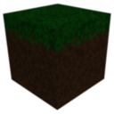

<p align="center">
  
</p>

<h1 align="center">SimpleCraft</h1>

<p align="center">A simple voxel game built in Java.</p>

<br>

## Build & Run

### Quick Start
The easiest way to build and run SimpleCraft is to use the provided convenience scripts:

```
# Building
Build.bat         # Build only.
Build.bat run     # Build and run in one step.
Build.bat dist    # Create distribution package (ZIP).
Build.bat dist -o # Create package and open folder.

# Running (requires building first)
SimpleCraft.bat   # Runs the game (JAR must exist).

# Clean up build artifacts
Clean.bat         # Removes build directories.

# Get help and environment info
Help.bat          # Displays available scripts and system info.
```

### Manual Build
You can also use Gradle commands directly:

```
gradlew.bat build
gradlew.bat run
```

### Distribution Packages
You can create distribution packages using the `Build.bat` script with the `dist` parameter:

```
Build.bat dist       # Build distribution packages.
Build.bat dist -o    # Build and open the output folder.
```

The distribution package is available in the `build/distributions/` folder as `SimpleCraft.zip`.

This package includes everything needed to run the game. Extract the zip file and use the included `SimpleCraft.bat` to launch the game.

<br>

## Coding Style

This project follows the [CODING_STYLE.md](CODING_STYLE.md) guidelines:

1. **No Type Inference** - Always use explicit types. `var` is forbidden.
2. **No Streams API** - Use traditional loops for visibility and performance.
3. **No Null Annotations** - Use explicit null checks.
4. **GC Awareness** - Avoid allocations in hot paths; prefer pooling.
5. **Primitive Preference** - Avoid boxing/unboxing overhead.
6. **Single-Line Code** - All control flow, conditions, signatures on single lines.
7. **Allman Braces** - Opening braces on new lines always.
8. **Complete Sentences** - Comments are documentation.
9. **Don't Over-Engineer** - YAGNI (You Ain't Gonna Need It).
10. **Traditional Switch Only** - No arrow syntax or switch expressions.

The style is automatically enforced when using VS Code with the provided configuration files in the `.vscode` directory.

<br>

## Requirements

| Component | Requirement |
|-----------|-------------|
| **OS** | Windows 10/11 (64-bit), Linux, or macOS 10.15+ |
| **Processor** | Intel Core i3 or AMD Ryzen 3 (2 cores, 2.5 GHz+) |
| **Memory** | 4 GB RAM |
| **Graphics** | OpenGL 3.2 compatible GPU with 1 GB VRAM |
| **Display** | 1152×864 resolution or higher |
| **Storage** | 500 MB available space |
| **Java** | JDK 25 or compatible runtime |

<br>

## Acknowledgments

This project was made possible by the following libraries:

- jMonkeyEngine - core game engine and rendering.
- Lemur UI - UI controls and layout.
- OpenSimplex2 noise - included directly as a single Java file (no external dependency).

Thanks to the authors and projects above for making development and distribution of SimpleCraft possible.

<br>

## License

This project is licensed under the [MIT License](LICENSE.txt).

<br>
